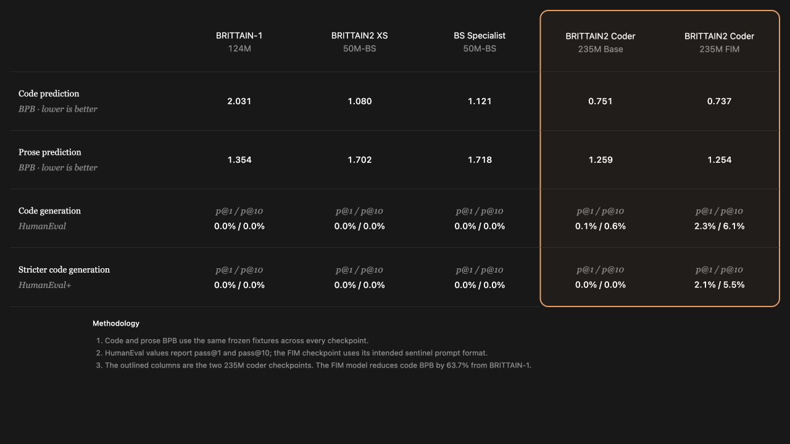

# BRITTAIN-2: First Models

This is the first group of released models for the BRITTAIN-2 generation. There
are four checkpoints here, with higher-context versions still planned after this
release.

BRITTAIN-2 supersedes BRITTAIN-1. These models were made with code generation in
mind. At this size they are not going to be strong assistants, and I do not want
to present them as that. They are base completion models built to test whether a
small model, a code-heavy corpus, and a more efficient tokenizer can still produce
something measurable and useful.

This release includes:

- `brittain2-xs-coder:50m-bs`
- `brittain2-xs-brittainscript-specialist:50m-bs`
- `brittain2-coder:235m-base-1k`
- `brittain2-coder:235m-fim-1k`

## Benchmark matrix

Lower BPB is better. BPB was measured with the same frozen Python-code and prose
fixtures across every checkpoint, so it remains comparable even when the
tokenizers are different. The image includes the four new BRITTAIN-2 models and
BRITTAIN-1 as the baseline.

| Model | Parameters | Context | Code BPB | Prose BPB | HumanEval p@1 | HumanEval p@10 | HumanEval+ p@1 | HumanEval+ p@10 |
|---|---:|---:|---:|---:|---:|---:|---:|---:|
| `brittain1:124m` | 123,551,232 | 1,024 | 2.031 | 1.354 | 0.0% | 0.0% | 0.0% | 0.0% |
| `brittain2-xs-coder:50m-bs` | 51,917,824 | 512 | 1.080 | 1.702 | 0.0% | 0.0% | 0.0% | 0.0% |
| `brittain2-xs-brittainscript-specialist:50m-bs` | 51,917,824 | 512 | 1.121 | 1.718 | 0.0% | 0.0% | 0.0% | 0.0% |
| `brittain2-coder:235m-base-1k` | 235,176,960 | 1,024 | 0.751 | 1.259 | 0.1% | 0.6% | 0.0% | 0.0% |
| `brittain2-coder:235m-fim-1k` | 235,180,032 | 1,024 | **0.737** | **1.254** | **2.3%** | **6.1%** | **2.1%** | **5.5%** |

HumanEval used 164 problems with 10 generated samples per problem. The FIM model
was evaluated through its intended FIM interface; the other models were evaluated
as normal left-to-right base models. That matters when comparing the result. The
FIM score shows what the checkpoint can do when it is used the way it was trained,
not that it suddenly became a general instruction model.

The result I care about most is the generational one. The 235M FIM checkpoint
cuts code BPB by 63.7% from BRITTAIN-1 and is the first BRITTAIN model with a
non-zero HumanEval+ score. The absolute score is still small, but it is a real
step instead of another model that only looks like it can code.

## XS variants

The XS checkpoints are mostly proof-of-concept models. Both training programs
were written entirely in BrittainScript, an interpreted language I started around
three years ago. That is what the `50m-bs` suffix means: trained **by**
BrittainScript, not originally trained **on** BrittainScript.

### brittain2-xs-coder:50m-bs

- Weight file: `brittain2_50m_bs.pt`
- Parameters: 51,917,824
- Pretraining: 1 billion tokens
- Checkpoint size: approximately 198 MiB
- Context length: 512 tokens
- Tokenizer: custom 32K code BPE
- Architecture: 6 layers, 8 heads, 512-dimensional embeddings
- Code BPB: 1.080
- Prose BPB: 1.702
- Human-written BrittainScript BPB: 1.102
- HumanEval pass@1: 0.0%
- HumanEval pass@10: 0.0%
- HumanEval+ pass@1: 0.0%
- HumanEval+ pass@10: 0.0%
- BrittainScript translation runtime: 30.0%
- Training stack: written entirely in BrittainScript

The 50M model beats BRITTAIN-1 on held-out code BPB while using less than half
the parameters. That does not make it a better general coding model—both score
zero on HumanEval—but it does show that the corpus and tokenizer moved the model
in the intended direction.

### brittain2-xs-brittainscript-specialist:50m-bs

- Weight file: `brittain2_xs_bs_mixed.pt`
- Parameters: 51,917,824
- Training: original 1-billion-token pretraining plus 3 specialist epochs
- Specialist mixture: native BrittainScript and verified Python-to-BrittainScript translations
- Checkpoint size: approximately 198 MiB
- Context length: 512 tokens
- Tokenizer: custom 32K code BPE
- Architecture: 6 layers, 8 heads, 512-dimensional embeddings
- Code BPB: 1.121
- Prose BPB: 1.718
- Human-written BrittainScript BPB: 0.922
- Prompted syntax validity: 96.7%
- Prompted runtime validity: 91.7%
- Translation syntax validity: 86.7%
- Translation runtime validity: 83.3%
- HumanEval pass@1: 0.0%
- HumanEval pass@10: 0.0%
- HumanEval+ pass@1: 0.0%
- HumanEval+ pass@10: 0.0%

The specialist is the mixed three-epoch checkpoint. It gave up a little general
code and prose BPB, but it was the strongest overall BrittainScript checkpoint:
better held-out BrittainScript BPB and much better translation runtime than the
original XS model.

## 235M coder variants

These are the main models in the release. They were trained on Python,
JavaScript, TypeScript, and 15% English. They can produce syntactically correct
code and sometimes working code, but they are still small base models and should
be judged as autocomplete models rather than assistants.

### brittain2-coder:235m-base-1k

- Weight file: `brittain2_235m_weights.pt`
- Parameters: 235,176,960
- Pretraining: 14.7 billion tokens
- Languages: Python, JavaScript, TypeScript, and English
- Checkpoint size: approximately 897 MiB
- Context length: 1,024 tokens
- Tokenizer: custom 32K code BPE
- Architecture: 16 layers, 16 heads, 1,024-dimensional embeddings
- Code BPB: 0.751
- Prose BPB: 1.259
- HumanEval pass@1: 0.1%
- HumanEval pass@10: 0.6%
- HumanEval+ pass@1: 0.0%
- HumanEval+ pass@10: 0.0%

### brittain2-coder:235m-fim-1k

- Weight file: `brittain2_235m_fim.pt`
- Parameters: 235,180,032
- Initial pretraining: 14.7 billion tokens
- Additional FIM exposure: approximately 2.2 billion tokens
- Total training exposure: approximately 16.9 billion tokens
- Checkpoint size: approximately 897 MiB
- Context length: 1,024 tokens
- Tokenizer: custom 32K FIM code BPE
- Architecture: 16 layers, 16 heads, 1,024-dimensional embeddings
- Code BPB: 0.737
- Prose BPB: 1.254
- HumanEval pass@1: 2.3%
- HumanEval pass@10: 6.1%
- HumanEval+ pass@1: 2.1%
- HumanEval+ pass@10: 5.5%
- Suffix-conditioned variable naming: 71%
- Identical output after changing suffix: 0%
- Hole-overrun rate: 25%

The suffix test is there because a lower FIM validation loss does not prove that
the model reads the code after the cursor. Changing the suffix changed the output,
and the generated middle named the variable required by the suffix 71% of the
time. The remaining weakness is termination: it still ran beyond the requested
hole in 25% of those samples.

## Downloads and checksums

The tokenizer files are committed under `tokenizers/brittain2-code-32k/`. Keep
them beside the repository when using the `.pt` checkpoints.

| Checkpoint | SHA-256 |
|---|---|
| `brittain2_50m_bs.pt` | `71500ce5d17eee092543b653d8fd143f0ad900f23bed591a3ce3e13ab99b2501` |
| `brittain2_xs_bs_mixed.pt` | `898a5453e07593a018e07331115321268be25cc9157c6236bb31b23ecafeef23` |
| `brittain2_235m_weights.pt` | `81831f8f6a0aaf8c0a06df4534b9e8a36d04f6855f974fb8d6f6c6d4fe79107e` |
| `brittain2_235m_fim.pt` | `82810e78c44afa0844dcf81cff37abc434445c264b67fe0b88b074c1896fe4c0` |

Setup and inference commands are in the main [`README.md`](README.md). Frozen
benchmark outputs are under `benchmarks/results/` so the reported scores do not
exist only in a screenshot. `release-assets/SHA256SUMS` can be uploaded beside
the four weights on the GitHub release.

## License

The four BRITTAIN model weights are released under the Apache License 2.0 along
with the repository code and tokenizer assets. Third-party training datasets are
not part of the release and keep their own licenses and terms. See
[`LICENSE`](LICENSE) and [`NOTICE`](NOTICE).
